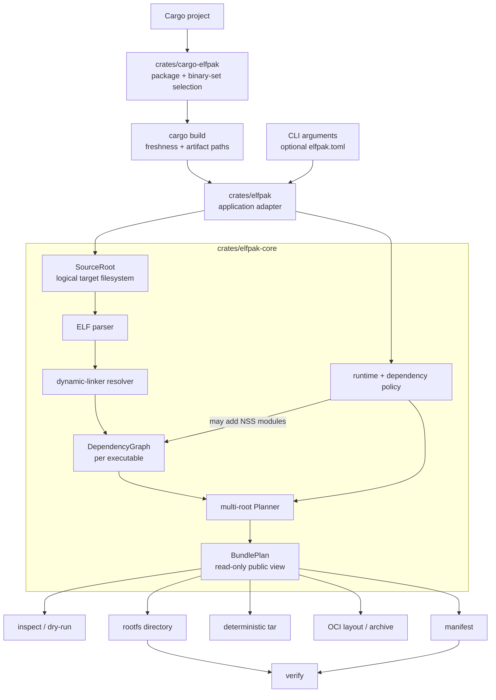

# Architecture

`elfpak` packages a Linux ELF executable and its runtime closure into a small,
deterministic root filesystem suitable for `FROM scratch` images. It is a Rust
workspace with standalone and Cargo-project adapters over a reusable core
library.

## System at a glance

The `BundlePlan` is the central boundary: discovery and validation finish
before any output is written. Its fields are crate-private and external callers
receive read-only views, so the public API preserves planner-established
invariants. Directory, tar, and OCI output consume the same plan; none
re-resolves dependencies.

## Workspace and ownership

| Location | Responsibility |
|---|---|
| `crates/cargo-elfpak` | Cargo adapter: workspace/package and binary selection, Cargo build option forwarding, freshness-aware artifact discovery, and dispatch into `elfpak bundle`. |
| `crates/elfpak` | Application boundary: Clap argument definitions, `elfpak.toml` parsing and precedence, command dispatch, output-path validation, and terminal rendering. |
| `crates/elfpak-core` | Reusable domain library: ELF parsing, source-root abstraction, loader-faithful dependency resolution, policy, graphing, plan construction, materialization, archives, manifests, and verification. |
| `fixtures/` | Small real programs used by integration and Docker tests: Axum, musl, and an off-path vendor library. |
| `crates/elfpak-core/tests/` | Unit/integration, filesystem-safety, resolver, robustness, and glibc-oracle tests. |
| `tests/docker/` | End-to-end scratch-image smoke scenarios. |
| `tests/oci/` | Daemonless OCI interoperability smoke test using Skopeo and Podman. |
| `fuzz/` | Separate nightly `cargo-fuzz` harness for the ELF parser boundary. |

Both command crates use small executable entry points around testable libraries.
`crates/elfpak` dispatches `inspect`, `bundle`, and `verify`; it deliberately
contains no ELF or resolver logic. `crates/cargo-elfpak` resolves a Cargo
binary set, lets Cargo make those artifacts fresh, then enters the same bundle
adapter with their artifact paths. Workspace-wide lint policy forbids
`unsafe` and the release profile favors small binaries (`opt-level = "z"`, LTO,
stripped, and `panic = "abort"`).

## Cargo adapter flow

`cargo-elfpak` reads `cargo metadata --no-deps`. `--all` selects every binary
target in the workspace; `--all-bins` and `--bins` select all or a subset from
the explicit/inferred package. Without a plural selector, the adapter prefers
an explicit `--bin`, `default-run`, a package-named binary, or a sole binary,
in that order. Remaining ambiguity is an error that lists valid selectors.

It executes one scoped `cargo build` with JSON messages enabled and matches
every selected `(PackageId, target name)` to one `compiler-artifact` message.
Cargo owns freshness, so custom profiles, targets, and target directories need
no path reconstruction. Cargo must succeed and report every artifact before the
bundle planner or any output destination is touched.

## Core model and data flow

### 1. Input and source filesystem

`SourceRoot` treats `--root` as the target system's logical `/`. It maps
logical paths to host paths while resolving symlinks inside that root only.
Symlink traversal and pending components are bounded, which prevents both
host-root escapes and unbounded path processing. This is what enables
cross-architecture packaging without executing the target.

The optional `elfpak.toml` is parsed with unknown fields rejected. For
`bundle`, command-line arguments override config values, which override
defaults. Paths that describe the project are rebased to the config file;
logical in-image paths remain absolute target paths.

### 2. ELF analysis and dependency resolution

`elf` uses `goblin` to parse ELF metadata: architecture/class/endianness,
object type, `PT_INTERP`, `DT_NEEDED`, RPATH/RUNPATH, loader flags, SONAME, and
references to `dlopen`-style APIs. Only x86_64 and aarch64 targets are accepted.

`Resolver` constructs the runtime closure without running the executable,
`ldd`, or `ldconfig`. It models the relevant glibc lookup inputs:

- the interpreter and recursive `DT_NEEDED` edges;
- RPATH inheritance and non-inherited RUNPATH;
- `$ORIGIN`, `$LIB`, and `$PLATFORM` expansion;
- explicit `--library-path` directories;
- parsed `ld.so.cache` and `ld.so.conf` (including include globs);
- architecture-specific default directories, while deliberately excluding
  CPU-specific glibc-hwcaps variants that the target filesystem alone cannot
  prove are safe to run; and
- `DF_1_NODEFLIB` plus candidate ABI validation.

Resolution builds a bounded `DependencyGraph`. Each node retains its original
logical destination, source file, symlink chain, digest, selected ELF metadata,
and inclusion relationship. The graph distinguishes application dependencies,
the kernel-loaded interpreter, and policy-added dependencies.

### 3. Planning and policy

`Planner` is the decision point. It converts one graph per executable to a
shared sorted `BundlePlan`, after checking install paths, architecture,
dependency allow-lists, and collisions across every closure. Identical shared
objects and symlinks are deduplicated; executable destinations and conflicting
contents must be unique. Planned entries are explicit
directories, symlinks, source-backed regular files, or generated files. Each
has a destination, normalized mode, size and digest where applicable, kind,
and inclusion reason.

Planning is one architectural stage but is split internally by role:
`plan/model.rs` defines the read-only plan data, `plan/builder.rs` owns entry
construction and destination precedence, and `plan/mod.rs` orchestrates the
resolver and policy decisions.

Runtime policy is separate from statically discoverable ELF dependencies:

- `minimal` contains only the executable closure;
- `web` additionally requests CA roots, `/tmp`, generated passwd/group,
  generated `nsswitch.conf`, and available NSS modules;
- timezone data and explicit includes are opt-in;
- `--user` supplies generated identity data when passwd/group is enabled.

The planner also decides whether to generate `/etc/ld.so.cache`. It does so
when any resolved library was found through a location its packaged loader
would not otherwise search, or when relocating an `$ORIGIN`-dependent
executable would break lookup. One cache is built from all compatible glibc
closures, so every application can resolve its shared objects. It is ignored by
musl, which does not use this cache.

Static analysis cannot determine `dlopen` dependencies. The plan remains valid
but carries a stable warning; callers can add known runtime files with
`--include`.

### 4. Materialization and attestation

`RootFsBuilder` writes a directory plan through a sibling staging directory,
then publishes it. It rejects unsafe output roots and refuses writes through
symlinked parents. Source-backed entries are rehashed while being copied, so a
source change after planning fails rather than producing an unrecorded artifact.
Without `--clean`, pre-existing unplanned output files are preserved; with it,
the finished staged tree replaces the old rootfs.

`TarBuilder` writes directly from the plan, not from the directory output. Tar
paths are relative; ordering, ownership, modes, and timestamps are pinned.
Directory output similarly normalizes modes. Its planned files and directories
share one materialization timestamp by default, or the explicit
`SOURCE_DATE_EPOCH` when reproducible directory metadata is required.

`OciLayoutBuilder` is the third plan renderer. It streams the same deterministic
tar as one uncompressed OCI layer while hashing it, then writes a stable image
configuration, manifest, and single-platform index into a content-addressed
layout. `OciArchiveBuilder` wraps that exact layout in a fixed-order transport
tar. Both stage beside their destinations and publish only after the complete
descriptor graph exists; neither invokes a daemon or registry.

`Manifest` records every application, the shared plan, resolved policy, output
locations, OCI image metadata and manifest digest when applicable, warnings,
and every planned entry's path, kind, reason, mode, size, digest, or link target.
It is written beside the artifacts, never into a rootfs. `verify` validates the
manifest before checking a materialized tree; normal verification detects
missing or altered entries, while `--strict` additionally detects unlisted
entries and mode changes.

## Operational invariants

- The source filesystem is read-only from elfpak's perspective; output is
  planned before materialization.
- Original library paths and symlink topology are preserved rather than
  relocated behind `LD_LIBRARY_PATH`.
- Tar and OCI output are byte-stable for equal inputs and tool version. Directory output
  applies `SOURCE_DATE_EPOCH` to planned files and directories on a best-effort
  basis; symlink timestamps are the documented platform limitation.
- Bounded graph, cache, search-path, directory-walk, and symlink processing
  protect against malformed or unexpectedly large inputs.
- Stable diagnostic codes are centralized in `diagnostics.rs` and shared by
  errors and warnings.

## Verification and delivery pipeline

`just check` runs formatting verification, Clippy with warnings denied, and the
workspace test suite. The suite covers parser robustness, path safety,
determinism, plan/manifest behavior, resolver semantics, and comparisons with
the real glibc loader. Docker smoke tests add scratch-image scenarios for web
services, CA roots, musl, generated loader caches, tar delivery, verification,
and cross-architecture packaging. `just oci-smoke` independently validates OCI
layout/archive inspection and execution with Skopeo and Podman.

The top-level `Dockerfile` builds a static musl `elfpak` for amd64 or arm64
with `rust-lld`, then publishes it in `FROM scratch`. The build stage runs on
the build platform and cross-compiles the requested target, avoiding emulation
for the tool itself.

## Scope and current design assessment

The architecture is internally consistent: dependency discovery, top-level
policy, planning, output, and verification have clear one-way boundaries
centered on the plan. CLI file configuration remains outside the reusable core,
and the test strategy independently checks the most loader-sensitive behavior.

Deliberate limitations are documented scope rather than design defects:
only x86_64/aarch64 are supported; `dlopen` cannot be fully discovered
statically; OCI output is single-platform with one uncompressed layer and no
direct push; runtime tracing and SBOM generation are not yet implemented.
