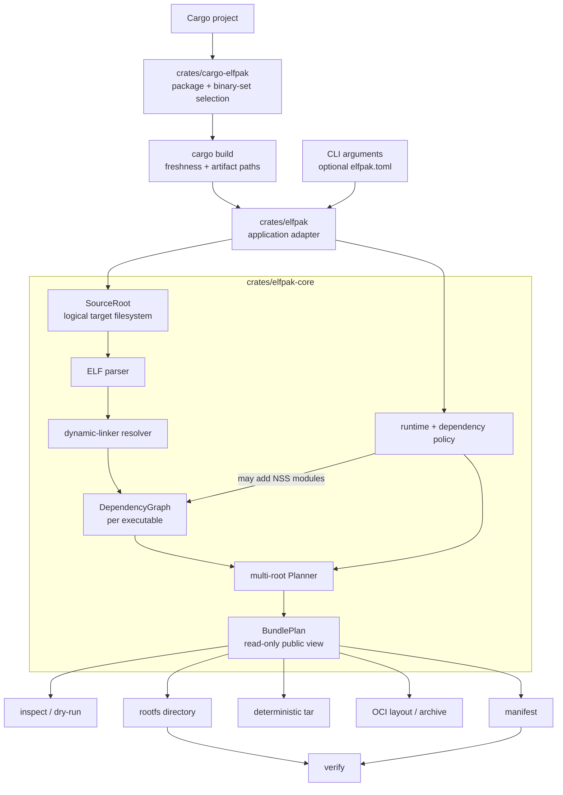

# Architecture

`elfpak` packages a Linux ELF executable and its runtime closure into a small, deterministic root filesystem for `FROM scratch` images. It is a Rust workspace. It has standalone and Cargo-project adapters over a reusable core library.

## System at a glance

The `BundlePlan` is the central boundary. Discovery and validation finish before `elfpak` writes any output. Its fields are crate-private, and external callers receive only read-only views. As a result, the public API keeps the invariants that the planner established. Directory, tar, and OCI output all use the same plan. None of them resolves dependencies again.

## Workspace and ownership

| Location | Responsibility |
|---|---|
| `crates/cargo-elfpak` | Cargo adapter: workspace/package and binary selection, Cargo build option forwarding, freshness-aware artifact discovery, and dispatch into `elfpak bundle`. |
| `crates/elfpak` | Application boundary: Clap argument definitions, `elfpak.toml` parsing and precedence, command dispatch, output-path validation, and terminal rendering. |
| `crates/elfpak-core` | Reusable domain library: ELF parsing, source-root abstraction, loader-faithful dependency resolution, policy, graphing, plan construction, materialization, archives, manifests, and verification. |
| `fixtures/` | Small real programs used by integration and Docker tests: Axum, musl, and an off-path vendor library. |
| `crates/elfpak-core/tests/` | Unit/integration, filesystem-safety, resolver, robustness, and glibc-oracle tests. |
| `tests/docker/` | End-to-end scratch-image smoke scenarios. |
| `tests/oci/` | Daemonless OCI interoperability smoke test using Skopeo and Podman. |
| `fuzz/` | Separate nightly `cargo-fuzz` harness for the ELF parser boundary. |

Both command crates use small executable entry points around testable libraries. `crates/elfpak` dispatches `inspect`, `bundle`, and `verify`. It contains no ELF or resolver logic, by design. `crates/cargo-elfpak` resolves a Cargo binary set, lets Cargo make those artifacts fresh, then enters the same bundle adapter with their artifact paths. Workspace-wide lint policy forbids `unsafe`. The release profile favors small binaries (`opt-level = "z"`, LTO, stripped, and `panic = "abort"`).

## Cargo adapter flow

`cargo-elfpak` reads `cargo metadata --no-deps`. `--all` selects every binary target in the workspace. `--all-bins` and `--bins` select all or a subset from the explicit or inferred package. Without a plural selector, the adapter prefers, in this order: an explicit `--bin`, `default-run`, a package-named binary, or a sole binary. Remaining ambiguity is an error that lists the valid selectors.

`cargo-elfpak` runs one scoped `cargo build` with JSON messages turned on, and matches every selected `(PackageId, target name)` to one `compiler-artifact` message. Cargo owns freshness, so `cargo-elfpak` needs no path reconstruction for custom profiles, targets, or target directories. Cargo must succeed and report every artifact before `elfpak` touches the bundle planner or any output destination.

## Core model and data flow

### 1. Input and source filesystem

`SourceRoot` treats `--root` as the target system's logical `/`. It maps logical paths to host paths, and resolves symlinks only inside that root. `SourceRoot` bounds symlink traversal and pending components. This prevents both host-root escapes and unbounded path processing, and it is what lets `elfpak` package across architectures without executing the target.

`elfpak` parses the optional `elfpak.toml` and rejects unknown fields. For `bundle`, command-line arguments override config values, and config values override defaults. `elfpak` rebases paths that describe the project to the config file. Logical in-image paths stay absolute target paths.

### 2. ELF analysis and dependency resolution

The `elf` module uses `goblin` to parse ELF metadata: architecture, class, endianness, object type, `PT_INTERP`, `DT_NEEDED`, RPATH/RUNPATH, loader flags, SONAME, and references to `dlopen`-style APIs. `elfpak` accepts only x86_64 and aarch64 targets.

`Resolver` builds the runtime closure without running the executable, `ldd`, or `ldconfig`. It models these glibc lookup inputs:

- the interpreter and recursive `DT_NEEDED` edges;
- RPATH inheritance and non-inherited RUNPATH;
- `$ORIGIN`, `$LIB`, and `$PLATFORM` expansion;
- explicit `--library-path` directories;
- parsed `ld.so.cache` and `ld.so.conf`, including include globs;
- architecture-specific default directories, while excluding CPU-specific glibc-hwcaps variants that the target filesystem alone cannot prove are safe to run; and
- `DF_1_NODEFLIB` plus candidate ABI validation.

Resolution builds a bounded `DependencyGraph`. Each node keeps its original logical destination, source file, symlink chain, digest, selected ELF metadata, and inclusion relationship. The graph distinguishes application dependencies, the kernel-loaded interpreter, and policy-added dependencies.

### 3. Planning and policy

`Planner` is the decision point. It checks install paths, architecture, dependency allow-lists, and collisions across every closure. Then it converts one graph per executable into a shared, sorted `BundlePlan`. `Planner` deduplicates identical shared objects and symlinks. Executable destinations and conflicting contents must be unique.

Each planning phase carries an authority: the closure outranks runtime policy, and runtime policy outranks an `--include` tree. The plan builder settles a contested destination by this order. When two entries both carry content, the plan builder records whichever entry won the contest. This lets the planner fail on a destination the bundle cannot express, while still allowing the one documented precedence: a generated `/etc/passwd` keeps its place against an `--include` of the source root's `/etc`. A final pass rejects any entry nested inside something that is not a directory. This is what keeps directory, tar, and OCI output describing the same tree.

Planned entries are explicit directories, symlinks, source-backed regular files, or generated files. Each entry has a destination, a normalized mode, a size and digest where applicable, a kind, and an inclusion reason.

Planning is one architectural stage, but it is split internally by role. `plan/model.rs` defines the read-only plan data. `plan/builder.rs` owns entry construction and destination precedence. `plan/mod.rs` coordinates the resolver and policy decisions.

Runtime policy stays separate from statically discoverable ELF dependencies:

- `minimal` contains only the executable closure;
- `web` also requests CA roots, `/tmp`, generated passwd/group, generated `nsswitch.conf`, and available NSS modules;
- timezone data and explicit includes are opt-in;
- `--user` supplies generated identity data when passwd/group is on.

The planner also decides whether to generate `/etc/ld.so.cache`. It generates one when `elfpak` found a resolved library through a location its packaged loader would not otherwise search, or when moving an `$ORIGIN`-dependent executable would break lookup. `Planner` builds one cache from all compatible glibc closures, so every application can resolve its shared objects. musl ignores this cache, because musl does not use it.

Static analysis cannot find `dlopen` dependencies. The plan stays valid but carries a stable warning. Callers can add known runtime files with `--include`.

### 4. Materialization and attestation

`RootFsBuilder` writes a directory plan through a sibling staging directory, then publishes it. It rejects unsafe output roots and refuses writes through symlinked parents. `RootFsBuilder` rehashes source-backed entries while it copies them, so a source change after planning fails the build instead of producing an unrecorded artifact. Without `--clean`, `RootFsBuilder` keeps pre-existing unplanned output files. With `--clean`, the finished staged tree replaces the old rootfs.

`TarBuilder` writes directly from the plan, not from the directory output. Tar paths are relative. Ordering, ownership, modes, and timestamps are fixed. Directory output also normalizes modes. By default its planned files and directories share one materialization timestamp. When reproducible directory metadata is required, set the explicit `SOURCE_DATE_EPOCH` instead.

`OciLayoutBuilder` is the third plan renderer. It streams the same deterministic tar as one uncompressed OCI layer while it hashes the tar, then writes a stable image configuration, manifest, and single-platform index into a content-addressed layout. `OciArchiveBuilder` wraps that exact layout in a fixed-order transport tar. Both stage beside their destinations and publish only after the complete descriptor graph exists. Neither invokes a daemon or registry.

`Manifest` records every application, the shared plan, resolved policy, output locations, OCI image metadata and manifest digest where applicable, warnings, and every planned entry's path, kind, reason, mode, size, digest, or link target. `elfpak` writes it beside the artifacts, never into a rootfs. `verify` checks the manifest before it checks a materialized tree. Normal verification finds missing or altered entries. `--strict` also finds unlisted entries and mode changes.

## Operational invariants

- `elfpak` treats the source filesystem as read-only, and plans output before it writes anything.
- `elfpak` preserves original library paths and symlink topology instead of moving files behind `LD_LIBRARY_PATH`.
- Tar and OCI output are byte-stable for equal inputs and the same tool version. Directory output applies `SOURCE_DATE_EPOCH` to planned files and directories on a best-effort basis. Symlink timestamps are a documented platform limitation.
- Bounded graph, cache, search-path, directory-walk, and symlink processing guard against malformed or unexpectedly large inputs.
- `diagnostics.rs` centralizes the stable diagnostic codes, and errors and warnings share them.

## Verification and delivery pipeline

`just check` runs a formatting check, Clippy with warnings denied, and the workspace test suite. The suite covers parser robustness, path safety, determinism, plan and manifest behavior, resolver semantics, and comparisons with the real glibc loader. Docker smoke tests add scratch-image scenarios for web services, CA roots, musl, generated loader caches, tar delivery, verification, and cross-architecture packaging. `just oci-smoke` independently checks OCI layout and archive inspection and execution with Skopeo and Podman.

The top-level `Dockerfile` builds a static musl `elfpak` for amd64 or arm64 with `rust-lld`, then publishes it in `FROM scratch`. The build stage runs on the build platform and cross-compiles the requested target. This avoids emulation for the tool itself.

## Scope and current design assessment

The architecture is internally consistent. Dependency discovery, top-level policy, planning, output, and verification have clear one-way boundaries centered on the plan. CLI file configuration stays outside the reusable core, and the test strategy independently checks the most loader-sensitive behavior.

The deliberate limitations are documented scope, not design defects: `elfpak` supports only x86_64/aarch64; `elfpak` cannot fully discover `dlopen` statically; OCI output is single-platform with one uncompressed layer and no direct push; runtime tracing and SBOM generation are not yet implemented.
