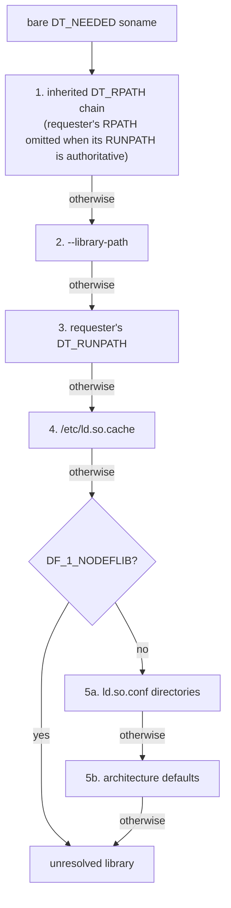

# elfpak documentation

```sh
cargo binstall elfpak
```

Reference for `elfpak`. See [README.md](README.md) for the short version.

- [Commands](#commands)
  - [`cargo elfpak bundle`](#cargo-elfpak-bundle)
  - [OCI image output](#oci-image-output)
- [Presets and runtime policy](#presets-and-runtime-policy)
- [Configuration file](#configuration-file)
- [Dependency policy](#dependency-policy)
- [Manifest and `verify`](#manifest-and-verify)
- [How dependencies are resolved](#how-dependencies-are-resolved)
  - [The generated loader cache](#the-generated-loader-cache)
- [Cross-architecture packaging](#cross-architecture-packaging)
- [Guarantees and determinism](#guarantees-and-determinism)
- [Repository layout](#repository-layout)
- [Development](#development)
- [Status](#status)

## Commands

```text
elfpak inspect <binary> [--root <sysroot>] [--library-path <dir>] [--json]

elfpak bundle <binary>...
    --output <dir>            where the rootfs directory is written
    --tar <file>              where the rootfs tar archive is written
    --oci-layout <dir>        where an OCI image layout is written
    --oci-archive <file>      where a tarred OCI image layout is written
    --image-tag <tag>         local name in the OCI index (default: latest)
    --entrypoint <arg>        OCI entrypoint argument (repeatable)
    --cmd <arg>               OCI default command argument (repeatable)
    --working-dir <dir>       OCI process working directory (default: /)
    --env <key=value>         OCI environment entry (repeatable)
    --label <key=value>       OCI image label (repeatable)
    --install <path>          path of the executable inside the rootfs
    --install-dir <dir>       directory for executables, preserving their names
    --root <sysroot>          logical / used for dependency lookup (default: /)
    --preset <minimal|web>    runtime policy preset
    --include <path>          extra file or directory, location preserved
    --allow-library <soname>  dependency allow-list (repeatable)
    --user <uid[:gid]|name:uid:gid>  identity the application runs as
    --library-path <dir>      extra search directory, like LD_LIBRARY_PATH
    --ca-certificates[=BOOL] --tmp[=BOOL] --passwd-group[=BOOL]
    --nsswitch[=BOOL] --tzdata[=BOOL] --ld-so-cache[=BOOL]
    --manifest <path> | --no-manifest
    --dry-run --clean --config <file> --no-config

elfpak verify <manifest> [--rootfs <dir>] [--strict]
```

You must supply at least one output flag. Any combination of `--output`, `--tar`, `--oci-layout`, and `--oci-archive` writes from the same immutable plan.

Global flags: `-q/--quiet`, and `-v`/`-vv` for verbosity. `-v` on `bundle` prints every planned file with the reason for its inclusion.

`inspect` and `bundle --dry-run` do the complete discovery, resolution, and planning work without touching the output filesystem.

### `cargo elfpak bundle`

`cargo-elfpak` adapts the bundle command to a Cargo project. Install it, then run the packaging options directly from the project.

```sh
cargo binstall cargo-elfpak
cargo elfpak bundle --release -p api --bin server \
    --output rootfs --install /app/server --preset web
```

Package selection uses `-p/--package` when you supply it. Otherwise the command uses, in this order: the package selected by `--manifest-path`, the package containing the working directory, Cargo's root package, or a sole workspace default member. An ambiguous virtual workspace fails the command and lists the packages that `-p` accepts.

Binary selection uses one of four modes:

- `--bin <NAME>` selects one binary from the selected package.
- `--bins <NAME>,<NAME>` selects a named subset from the selected package.
- `--all-bins` selects every binary from the selected package.
- `--all` selects every binary target from every workspace member.

Without one of these modes, selection honors `default-run`, then a binary named like the package, then a sole binary target. If more than one binary remains, the command fails and lists the names that `--bin` accepts. `--bins` and `--all-bins` use the normal package inference when you omit `-p`. `--all` conflicts with `-p` and every other binary selector.

Before it bundles, the adapter always runs one appropriately scoped `cargo build`. Cargo's own fingerprinting decides whether each executable is fresh or needs a rebuild. This fingerprint covers dependencies, build scripts, features, profiles, compiler options, and configuration. Executable paths come from Cargo's JSON artifact messages, not from a guessed `target/` layout.

The Cargo build options are:

```text
-p, --package <PACKAGE>
--bin <NAME> | --bins <NAMES> | --all-bins | --all
--release | --profile <NAME>
--target <TRIPLE>        --target-dir <DIR>
--manifest-path <PATH>
--features <FEATURES>    --all-features    --no-default-features
--locked                 --offline         --frozen
```

All other options are the standalone `elfpak bundle` options documented below. The Cargo artifacts replace the `binary` or `binaries` values in `elfpak.toml`. Every other configuration and CLI precedence rule stays the same. Multiple selected binaries keep their target names beneath `--install-dir` (or `/` when you omit it). If workspace packages expose the same binary target name, `--all` fails and names both packages. Select a non-colliding subset instead.

### `inspect`

```sh
elfpak inspect ./server
./server
  ELF64 LSB x86_64

  interpreter:
    /lib64/ld-linux-x86-64.so.2
      -> /usr/lib/x86_64-linux-gnu/ld-linux-x86-64.so.2

  dependencies:
    libgcc_s.so.1
      /usr/lib/x86_64-linux-gnu/libgcc_s.so.1

    libc.so.6
      /usr/lib/x86_64-linux-gnu/libc.so.6

  runtime:
    3 shared objects
    7.7 MiB

  warnings:
    none
```

`--json` emits the same plan in the manifest format, for use in scripts.

### `bundle`

```sh
elfpak bundle ./server \
    --output /out/rootfs \
    --install /app/server \
    --preset web \
    --user 65532:65532
```

`elfpak` installs the executable at `--install`. Every other file keeps the path it had in the source root. `elfpak` writes the manifest beside the rootfs, never inside it. `--manifest` overrides the location. `--no-manifest` turns off the manifest.

Pass multiple executables with `--install-dir` to create one bundle. `elfpak` keeps their basenames and stores shared libraries once.

```sh
elfpak bundle ./server ./migrate \
    --output /out/rootfs \
    --install-dir /app \
    --preset web
```

With no install option, binaries land at `/<basename>`. The singular `--install` cannot represent multiple binaries, so `elfpak` rejects it in that mode. Duplicate basenames, mixed executable architectures, and cross-application path collisions all fail before `elfpak` publishes any output.

### Tar output

`--tar` writes a tar archive instead of a directory, or in addition to one.

```sh
elfpak bundle ./server --tar /out/rootfs.tar --install /app/server --preset web
```

```dockerfile
FROM scratch
ADD rootfs.tar /
ENTRYPOINT ["/app/server"]
```

`elfpak` writes the archive from the bundle plan, not from a materialized directory, so both backends describe exactly the same tree. It is deterministic by construction: entries follow plan order, ownership is `0:0`, timestamps come from `SOURCE_DATE_EPOCH` (default: the Unix epoch), modes are the normalized ones from the plan, and paths are relative. The same plan produces a byte-identical archive on every run.

`elfpak` stores symlinks as symlink entries. Directories keep their modes, including the sticky bit on `/tmp`.

### OCI image output

`--oci-layout` and `--oci-archive` build a runnable OCI image without Docker, a daemon, network access, or registry credentials.

```sh
cargo elfpak bundle --release --bin server \
    --oci-layout dist/server.oci \
    --oci-archive dist/server.oci.tar \
    --install /app/server \
    --image-tag ci \
    --entrypoint /app/server \
    --cmd --serve \
    --working-dir /app \
    --env RUST_LOG=info \
    --label org.opencontainers.image.source=https://github.com/example/server
```

Each `--entrypoint` and `--cmd` occurrence supplies exactly one argument, so `elfpak` keeps the argument boundaries. `elfpak` accepts leading-hyphen values such as `--serve`. `--env` and `--label` are repeatable `KEY=VALUE` entries. A single application defaults its entrypoint to its installed path. A multi-binary bundle must name an entrypoint. The local tag defaults to `latest`, the working directory defaults to `/`, and command, environment, and labels default to empty.

CLI scalar values override `[image]` scalars. A non-empty CLI collection replaces its complete TOML collection. OCI output paths follow the usual CLI-over-`[package]` precedence.

```toml
[package]
binary = "target/release/server"
install = "/app/server"
oci_layout = "dist/server.oci"
oci_archive = "dist/server.oci.tar"

[image]
tag = "ci"
entrypoint = ["/app/server"]
cmd = ["--serve"]
working_dir = "/app"
env = { RUST_LOG = "info" }
labels = { "org.opencontainers.image.source" = "https://github.com/example/server" }
```

`--user` still controls the generated identity files, and it also sets the OCI process user to the resolved numeric `uid:gid`. It does not change layer file ownership, which stays normalized to `0:0`.

The directory contains `oci-layout`, `index.json`, and content-addressed blobs under `blobs/sha256/`. The archive contains that complete layout. It is not the rootfs tar that `--tar` produces, so do not extract it at `/`. Both forms are single-platform (`linux/amd64` for x86_64 or `linux/arm64` for aarch64) with one uncompressed, deterministic layer. Multi-platform index assembly, compression, and direct registry push stay outside this interface, by design.

The local tag is part of transport syntax in the following examples:

```sh
skopeo inspect oci:$PWD/dist/server.oci:ci
skopeo inspect oci-archive:$PWD/dist/server.oci.tar:ci
skopeo copy oci-archive:$PWD/dist/server.oci.tar:ci \
    docker://ghcr.io/example/server:sha-0123456789abcdef

$ oras cp --from-oci-layout \
    $PWD/dist/server.oci:ci ghcr.io/example/server:latest

$ podman run --rm oci-archive:$PWD/dist/server.oci.tar:ci --version

$ ctr images import --base-name ghcr.io/example/server dist/server.oci.tar
$ nerdctl load --input dist/server.oci.tar

$ crane push dist/server.oci ghcr.io/example/server:latest
```

For ORAS, `oras cp --from-oci-layout` also accepts the layout tar. A generic `oras push server.oci.tar` instead uploads one opaque tar artifact and does not publish the runnable image graph. Crane's directory input is the OCI layout. Use Skopeo or ORAS for an OCI layout archive.

A minimal GitHub Actions flow builds and tests the Rust program, then packages it, smoke-tests it, and publishes the exact OCI archive to GHCR.

```yaml
name: CI
on: [pull_request, push]

jobs:
  image:
    runs-on: ubuntu-latest
    permissions:
      contents: read
      packages: write
    steps:
      - uses: actions/checkout@v7
        with:
          persist-credentials: false
      - uses: dtolnay/rust-toolchain@stable
      - run: sudo apt-get update && sudo apt-get install --yes skopeo podman
      - run: cargo install cargo-elfpak --locked
      - run: cargo test --workspace --all-targets --locked
      - name: Build and test OCI image
        env:
          LOCAL_TAG: ci-${{ github.sha }}
        run: |
          mkdir -p dist
          cargo elfpak bundle --release --locked --bin my-server \
            --oci-archive dist/my-server.oci.tar \
            --image-tag "$LOCAL_TAG" \
            --install /app/my-server \
            --entrypoint /app/my-server
          skopeo inspect "oci-archive:${PWD}/dist/my-server.oci.tar:${LOCAL_TAG}"
          podman run --rm \
            "oci-archive:${PWD}/dist/my-server.oci.tar:${LOCAL_TAG}" --version
      - name: Publish successful pushes
        if: github.event_name == 'push'
        env:
          GHCR_TOKEN: ${{ secrets.GITHUB_TOKEN }}
          LOCAL_TAG: ci-${{ github.sha }}
        run: |
          printf '%s' "$GHCR_TOKEN" | skopeo login ghcr.io \
            --username "$GITHUB_ACTOR" --password-stdin
          IMAGE="ghcr.io/${GITHUB_REPOSITORY,,}"
          skopeo copy --all \
            "oci-archive:${PWD}/dist/my-server.oci.tar:${LOCAL_TAG}" \
            "docker://${IMAGE}:sha-${GITHUB_SHA}"
```

For stricter trust boundaries, split packaging and publication into separate jobs. Transfer the tested archive as a workflow artifact, and grant `packages: write` only to the publish job.

## Presets and runtime policy

ELF analysis can prove which shared objects a program loads. It cannot prove which *data* files the program needs. `elfpak` models those separately, as runtime policy.

| Preset    | Contents |
|-----------|----------|
| `minimal` | the ELF closure only: application, `PT_INTERP`, recursive `DT_NEEDED` |
| `web`     | the ELF closure plus CA certificates, `/tmp`, `passwd`/`group`, `nsswitch.conf` |

A preset is convenience configuration. It is never hidden behavior. You can also switch on each feature by itself; the preset only supplies the defaults.

```sh
elfpak bundle ./server -o /rootfs --preset web --tzdata --tmp=false
```

* `--ca-certificates` — the system CA bundle. `elfpak` finds it at its usual location and copies it there, with its symlink chain intact.
* `--tmp` — an empty `/tmp` with mode `1777`.
* `--passwd-group` — generated `/etc/passwd` and `/etc/group` files that contain `root`, `nobody`, and the `--user` identity. `elfpak` generates these files instead of copying them, so the output stays deterministic and leaks nothing from the build host.
* `--nsswitch` — a generated `/etc/nsswitch.conf`, plus the glibc NSS modules (`libnss_files`, `libnss_dns`, `libresolv`) when the source root still ships them. Since glibc 2.34, these modules are built into `libc.so.6`.
* `--tzdata` — `/usr/share/zoneinfo` and `/etc/localtime`. This is opt-in in every preset, because most services do not need it.
* `--include <path>` — any other file or directory, copied to the same absolute path. `elfpak` copies directories recursively and reproduces symlinks inside them as symlinks.
* `--ld-so-cache` — a generated `/etc/ld.so.cache`. Unlike the other features, this one defaults to *automatic*: `elfpak` writes a cache exactly when the closure contains something the loader could not otherwise find (see [The generated loader cache](#the-generated-loader-cache)). `--ld-so-cache` always writes one. `--ld-so-cache=false` never does.

With `web`, an application that makes outbound HTTPS calls needs no CA-specific code, because the system trust store is exactly where the TLS stack already looks. You can still pin a bundle explicitly in application code, but it is opt-in, not a requirement.

For rootfs and rootfs-tar consumers, `--user` records an identity in `passwd`/`group`, but the container runtime still decides who runs the process. OCI output also records the numeric identity in its runtime config.

`--user` accepts `uid`, `uid:gid`, and `name:uid:gid`. A name is 1 to 32 characters of `A-Z`, `a-z`, `0-9`, `_`, or `-`, because `elfpak` writes it into colon- and newline-delimited system files. Every image already contains `root:0:0` and `nobody:65534:65534`. As a result, a bare `uid[:gid]` that matches one of those IDs *is* that account and adds no second entry. `elfpak` rejects a name for one of them with different IDs, and rejects a claim on UID `0` or `65534` under another name. Sharing a reserved *group* ID is ordinary: `--user 1000:65534` puts the account in `nogroup`.

### When two features want the same path

`elfpak` plans every entry before it writes anything, so it settles a destination that two features both claim once, in the plan. Implicit directory scaffolding never displaces a real entry, and a real entry always replaces scaffolding. Explicit directories that runtime policy or `--include` request compete like files and symlinks. Between real entries, the phases decide by how little choice there was about the path, in this order: the ELF closure first, because its objects must sit exactly where the loader looks for them, then runtime policy, then `--include`. A generated `/etc/passwd` therefore keeps its place against an `--include` of the source root's `/etc`. `elfpak bundle -v` lists the winner with its reason.

Two incompatible real entries are an error, not a matter of precedence, because the bundle can express only one of them: `--install` landing on a library the closure needs at that exact path, on a file runtime policy generates, or on a directory policy requires. `E4001` names both entries. The same check rejects a plan whose entries would nest inside something that is not a directory. Directory output cannot create that nesting, and tar output would silently write through it.

One file can legitimately reach the plan more than once: `/etc/localtime` can resolve into the zone database that `--tzdata` already copied, or an `--include` can name a library directory the closure also needs. When the mode, size, contents, and link target are identical, `elfpak` treats those as the same entry, not a contest.

## Configuration file

`elfpak.toml` is optional. `elfpak` picks it up from the working directory. CLI arguments always win. `--config <file>` selects another file, and `--no-config` ignores it entirely.

```toml
[package]
binary = "/my-server"
install = "/app/server"
output = "/rootfs"
root = "/"

[runtime]
preset = "web"
user = "65532:65532"
tzdata = false
# ld_so_cache = true   # force a loader cache; omit to let the closure decide

[include]
paths = ["/app/templates"]

[dependencies]
allow = ["libc.so.6", "libgcc_s.so.1"]
```

`elfpak` rejects unknown keys instead of ignoring them, so a typo surfaces immediately. The selected configuration file must be a regular file no larger than 1 MiB. `elfpak` rejects special files and oversized input before it parses them.

For a standalone multi-binary bundle, replace the singular package keys with these:

```toml
[package]
binaries = ["target/release/server", "target/release/migrate"]
install_dir = "/app"
output = "/rootfs"
```

`binary` conflicts with `binaries`, and `install` conflicts with `install_dir`. `elfpak` resolves relative binary paths beside the configuration file. Install paths remain logical paths inside the rootfs.

## Dependency policy

`[dependencies].allow` (or the repeatable `--allow-library`) turns the runtime closure into a contract. A new native dependency then fails the build instead of growing the image without notice. This is why the allow-list belongs in CI.

```text
error[E2002]:
  library `libssl.so.3` is not allowed by dependency policy

required by:
  /app/server

add:
  --allow-library libssl.so.3
```

Libraries match on `DT_SONAME` or on file name.

The allow-list covers the application's *own* ELF closure — what a new `use` or `#include` in the source would add. Two things stay deliberately outside it, because no caller could name them up front: the ELF interpreter, which is not a `DT_NEEDED` dependency, and anything runtime policy pulled in, such as the NSS modules that `--nsswitch` adds when the source root still ships them.

## Manifest and `verify`

Every bundle writes `elfpak-manifest.json` beside the rootfs. It records each file, its digest, its mode, and the reason for it.

```json
{
  "binary": "/app/server",
  "binaries": ["/app/server", "/app/migrate"],
  "architecture": "x86_64",
  "interpreter": "/lib64/ld-linux-x86-64.so.2",
  "policy": {
    "preset": "web",
    "ca_certificates": true,
    "tmp": true,
    "passwd_group": true,
    "nsswitch": true,
    "tzdata": false,
    "ld_so_cache": "auto",
    "user": "app:65532:65532"
  },
  "files": [
    { "path": "/app/server", "reason": "application", "sha256": "…" },
    {
      "path": "/usr/lib/x86_64-linux-gnu/libc.so.6",
      "reason": { "needed_by": "/app/server", "soname": "libc.so.6" },
      "sha256": "…"
    }
  ]
}
```

A reason is one of `application`, `interpreter`, `include`, `{ needed_by, soname }`, or `{ runtime_policy }`. This makes a bundle auditable and diffable, and it is the basis for future SBOM output.

The `policy` object records the *resolved* runtime and dependency policy: the preset, every runtime feature, the user identity, explicit includes, and the allow-list. Reproducing a bundle needs the same configuration, so the configuration is part of the record instead of something the caller has to remember.

Manifest version 3 records every installed application in `binaries`, and keeps `binary` as the primary or first application for compatibility. Version 4 adds the `image` object, which records the resolved OCI image configuration and its manifest digest whenever `elfpak` wrote an OCI output. Older manifests without `binaries` or `image` still verify.

```sh
elfpak verify /out/elfpak-manifest.json
ok: 25 entries verified in /out/rootfs
```

`verify` checks that every entry exists, that regular files hash as recorded, and that symlinks still point where they did. It needs no Docker. Pass `--rootfs` to check a tree other than the one recorded in the manifest. `elfpak` bounds manifest input and strict filesystem discovery. An input that exceeds the supported byte or entry limits fails instead of growing memory or work without limit.

By default, this proves that nothing was **removed or altered**. `--strict` also walks the rootfs and fails on anything the manifest does not list, so it catches files *added* after `elfpak` built the bundle. It also compares permission bits, which a content digest cannot see — a file that became setuid still hashes the same.

```sh
elfpak verify /out/elfpak-manifest.json --strict
  /opt/payload/extra.so: present in the rootfs but not listed in the manifest
error[E5001]:
  verification failed: 1 problem(s) across 25 manifest entries
```

## How dependencies are resolved

`elfpak` models the glibc loader. It does not search for matching filenames.

* `PT_INTERP` and recursive `DT_NEEDED`
* `DT_RPATH`, inherited down the loading chain
* `DT_RUNPATH`, which — matching the loader — is *not* inherited and takes precedence over `DT_RPATH` on the object that declares it
* `$ORIGIN`, `$LIB` and `$PLATFORM` token expansion
* `/etc/ld.so.cache`, parsed directly in both the historical and the current format; `ldconfig` is never invoked
* `/etc/ld.so.conf`, including `include` globs
* architecture-specific default directories; CPU-specific `glibc-hwcaps` variants are deliberately not selected because a sysroot does not identify the deployment CPU
* `DF_1_NODEFLIB`
* architecture, ELF class and endianness validation of every candidate, so a file that merely has the right name can never satisfy a lookup

For a bare soname, lookup follows this order. A `DT_NEEDED` value that contains a slash bypasses the search. `elfpak` resolves it as an absolute logical path after token expansion.



At every step, a candidate must be a shared ELF object with the expected architecture, class, and endianness. The first compatible candidate ends the search. `elfpak` remembers an incompatible candidate for the final diagnostic while the lookup continues.

`elfpak` preserves original paths and symlink structure: `libfoo.so.1 -> libfoo.so.1.4.2` stays a symlink, `/lib -> usr/lib` stays a symlink, and `elfpak` never relocates libraries into a private directory with a compensating `LD_LIBRARY_PATH`. The generated rootfs keeps the original loader contract.

`elfpak` cannot follow `dlopen` statically. When an object references it, `elfpak` warns and continues. Use `--include` for anything loaded at runtime.

### The generated loader cache

The loader finds a library in one of three ways: a directory the object itself names (`DT_RPATH`/`DT_RUNPATH`), a directory built into the loader (`/lib`, `/usr/lib`, and the architecture variants), or `/etc/ld.so.cache`. On a normal system, `ldconfig` maintains that cache. This is how a library in `/usr/local/lib` or `/opt/…/lib` gets found at all.

A bundle has no `ldconfig`, and copying the build host's cache would describe the host's filesystem, not the bundle's. So `elfpak` writes the cache itself, straight from the plan.

```sh
elfpak bundle ./server -o /rootfs --install /app/server --library-path /opt/vendor/lib -v
    - /etc/ld.so.cache                       runtime policy: ld-so-cache
    ...
```

It is a real `glibc-ld.so.cache1.1` image: every shared object in the bundle, mapped from its `DT_SONAME` to the path it occupies in the rootfs, with the architecture's cache flags, in the descending order that glibc's binary search expects. The test suite checks the cache against the real loader, not against `elfpak`'s own reading of it. It packages a fixture whose library sits outside every default directory, `chroot`s into it, and runs it.

Because `elfpak` generates the cache instead of copying it, the cache stays deterministic. `elfpak` records it in the manifest like any other file, and it lists only libraries that are actually in the bundle.

By default, `elfpak` writes a cache only when the bundle needs one. So a service whose libraries all live in `/usr/lib/<tuple>` — the common case — gets exactly the same image as before. `--ld-so-cache` forces one. `--ld-so-cache=false` suppresses it and brings back the warnings below.

A musl program never gets one, whatever the flag says. musl reads `/etc/ld-musl-<arch>.path` and ignores `ld.so.cache` entirely, so a cache would look like a fix and change nothing. `elfpak` reports such a bundle instead.

## Diagnostics

Every message that `elfpak` prints carries a stable code: `error[E2001]` when the run failed and wrote nothing, `warning[E2005]` when it succeeded but found something worth reporting. Scripts match on these codes, so the codes do not change, and no code ever means two things. Errors and warnings share one namespace, declared and checked together in `crates/elfpak-core/src/diagnostics.rs`.

The family shows what a code is about: `E1xxx` reads an object, `E2xxx` resolves a dependency, `E3xxx` touches a path, `E4xxx` is configuration, `E5xxx` is verification.

### Errors

An error ends the run with a non-zero exit status.

| Code    | Meaning |
|---------|---------|
| `E1000` | An I/O operation on a named path failed. |
| `E1001` | A file starts with the ELF magic but does not parse. |
| `E1002` | The input is not an ELF object at all. |
| `E1003` | The target architecture is not one `elfpak` supports. |
| `E1005` | A bounded resource — closure size, graph size, search path — was exceeded. |
| `E1006` | A source file changed between planning and writing. |
| `E2001` | A `DT_NEEDED` library could not be resolved; the directories searched are listed. |
| `E2002` | A library is not on the `--allow-library` list. |
| `E2003` | A candidate was found but targets the wrong architecture. |
| `E2004` | A runtime policy feature found nothing to include (no CA bundle, no tzdata). |
| `E3001` | A path would escape the source or output root. |
| `E3002` | An `--include` names something the source root does not have. |
| `E3003` | Too many symlink hops while resolving a path. |
| `E4001` | Invalid configuration: a bad flag value, a missing output, a colliding install path. |
| `E4002` | A manifest could not be read or does not parse. |
| `E5001` | `elfpak verify` found at least one problem. |

### Warnings

A warning never fails a build. It reports something static analysis found that the bundle cannot express, and `elfpak` records it in the manifest.

| Code    | Meaning |
|---------|---------|
| `E1004` | An object references `dlopen`, so its runtime closure is not fully knowable. |
| `E2005` | A library was found somewhere the loader will not look inside the bundle. |
| `E2006` | `--install` moves an executable that declares `$ORIGIN`-relative search paths. |
| `E4003` | `--user` was given without `passwd`/`group` files. |

`E2005` and `E2006` describe the two ways a bundle can end up unable to load a library it contains: one where the library sits in a directory the loader does not search, and one where the executable's own `$ORIGIN`-relative search paths stop pointing at anything once installed elsewhere. `elfpak` fixes both conditions instead of only reporting them, because they are exactly the conditions under which it generates a loader cache. They appear only when `--ld-so-cache=false` rules that out, or for a target whose cache format `elfpak` cannot write.

## Cross-architecture packaging

`--root` abstracts the source filesystem, and the resolver treats it as the logical `/`. An x86_64 `elfpak` can therefore package an aarch64 application from an aarch64 sysroot without executing anything.

```sh
elfpak bundle /sysroot/app/server \
    --root /sysroot \
    --output /rootfs \
    --install /app/server
```

Supported target architectures are x86_64 and aarch64. Anything else fails with `E1003`, which names the architecture it found and the raw `e_machine` value.

## Guarantees and determinism

`elfpak bundle`:

* does not execute the target
* does not call `ldd` or `ldconfig` — it generates a loader cache, when needed, directly from the plan
* does not run shell commands
* does not contact the network
* does not invoke Docker
* treats the source filesystem as read-only
* writes only to requested artifact paths and their temporary siblings, and creates missing artifact parent directories when needed
* records every included file and the reason for it

These guarantees describe the standalone packaging phase. `cargo elfpak bundle` invokes Cargo first, by design, and so it may run whatever local build work Cargo requires. After Cargo reports the executable, the same standalone planning and output guarantees apply.

`elfpak` assembles each directory, tar, OCI, and manifest artifact in a sibling temporary path, and publishes it only after it is complete. It exchanges existing directories atomically when the filesystem supports this. On filesystems without atomic exchange, including WSL's Windows mounts, `elfpak` uses a rollback-capable rename sequence that briefly removes the visible directory name. If an individual artifact write fails, no partial replacement is exposed. When you request more than one output, `elfpak` publishes the artifacts one after another, so a later failure can leave already-published earlier artifacts in place. Run the command again after you fix the failure, instead of treating a mixed set as a verified release. With `--clean`, `elfpak` likewise keeps the previous rootfs until its replacement is ready.

```mermaid
sequenceDiagram
    participant CLI as bundle command
    participant Planner as Planner
    participant Rootfs as rootfs destination
    participant Tar as tar destination
    participant Manifest as manifest destination

    CLI->>Planner: discover and validate without writing
    Planner-->>CLI: complete immutable BundlePlan
    opt --output requested
        CLI->>Rootfs: build in sibling stage
        CLI->>Rootfs: publish completed directory
    end
    opt --tar requested
        CLI->>Tar: build in sibling stage
        CLI->>Tar: publish completed archive
    end
    opt manifest enabled
        CLI->>Manifest: write in sibling stage
        CLI->>Manifest: publish completed manifest
    end
    Note over Rootfs,Manifest: Each artifact is staged completely; the set is published sequentially
```

Tar output is deterministic for the same application binaries, source root, configuration, and `elfpak` version: entries are ordered by destination, file modes are normalized to `0755`/`0644`, and timestamps use `SOURCE_DATE_EPOCH` (default: the Unix epoch). By default, directory output uses one materialization timestamp for its planned files and directories. Set `SOURCE_DATE_EPOCH` to request a fixed timestamp instead. Directory timestamp changes are best-effort, because not every filesystem supports them, and you cannot pin symlink timestamps portably. Use the byte-identical tar backend when reproducibility is a hard requirement.

Path handling is defensive throughout. `elfpak` normalizes destinations lexically, so `..` can never escape the output root. It refuses writes through a symlinked parent, and it unlinks anything already occupying a destination before it writes to it — a leftover symlink is never followed out of the output root. `--clean` refuses to delete a filesystem root, and no directory output may contain or equal `--root`, because publishing replaces that directory and would destroy the filesystem being packaged.

`--oci-layout` publishes by replacing its destination. It accepts only a destination that does not exist, is empty, or already holds both a valid regular `oci-layout` JSON marker for layout version `1.0.0` and a valid bounded `index.json`. Pass `--clean` to replace a directory holding anything else. `elfpak` writes files inside a published layout with mode `0644`, and they are on disk before `index.json` names them.

## Repository layout

```text
crates/cargo-elfpak/  Cargo adapter: selection, freshness-aware build, dispatch
crates/elfpak/        CLI: argument parsing, config loading, rendering
crates/elfpak-core/   library: elf, resolver, graph, policy, plan, rootfs, manifest
fixtures/axum-server/ integration fixture: a real Axum service
fixtures/musl-hello/  integration fixture: a musl-linked program
fixtures/vendor-lib/  integration fixture: a library outside the loader's path
fuzz/                 cargo-fuzz targets for the parsing boundary
tests/docker/         Docker smoke tests, one Dockerfile per scenario
tests/oci/            daemonless Skopeo/Podman interoperability smoke test
Dockerfile            static elfpak distribution image (FROM scratch)
```

`elfpak-core` holds the reusable implementation. No resolution logic lives in the CLI crate. `crates/elfpak` is itself a library with a six-line `main.rs` around it: `lib.rs` dispatches, and one module per subcommand does the work.

Inside `elfpak-core`, the dependencies run one way: `elf` and `source` read the world, `resolver` turns a soname into a file, `graph` records what it found and why, top-level `policy` supplies explicit runtime choices, `plan` turns those inputs into a `BundlePlan`, and `rootfs` writes one. `plan` is the only module that decides output membership, and nothing downstream of it resolves dependencies again. `diagnostics` sits beside them all and owns every code the CLI prints.

`elfpak` pins base images by tag and digest, and no build step installs packages from a distribution mirror, so a digest really does describe what was built. The tests build every image for all architectures under test in one buildx invocation.

## Building the elfpak image

The distribution image is multi-platform and cross-compiled. Its builder stage runs on the *build* platform (`FROM --platform=$BUILDPLATFORM`) and targets `$TARGETARCH`, so a native compiler produces every architecture and none of it runs under emulation.

```sh
docker buildx build --platform linux/amd64,linux/arm64 -t elfpak:local --load .
```

`elfpak` has no C dependencies, so `rust-lld` links every supported target and you do not need to install a cross toolchain. The result is a static musl binary per architecture, together in one image.

`--load` writes a multi-platform image into the local image store, and this requires the containerd image store to be on. `--push` writes it to a registry and has no such requirement. Where the tests cannot load a multi-platform image, the smoke tests fall back to one tag per platform.

See the [Docker multi-platform documentation][multi-platform] for details.

[multi-platform]: https://docs.docker.com/build/building/multi-platform/

## Development

Minimum supported Rust version: **1.98**.

```sh
just check                       # fmt, clippy -D warnings, and the whole suite
just test                        # unit and integration tests
tests/docker/smoke.sh            # all Docker smoke tests
$ tests/docker/smoke.sh axum       # Axum on scratch, host architecture
$ tests/docker/smoke.sh axum-arm64 # Axum on scratch, linux/arm64
$ tests/docker/smoke.sh ca         # CA roots come from the bundle, not the binary
$ tests/docker/smoke.sh musl       # a dynamically linked musl program
$ tests/docker/smoke.sh ldcache    # a library the loader only finds through a cache
$ tests/docker/smoke.sh tar        # the same service delivered as a tar and ADDed
$ tests/docker/smoke.sh verify     # `elfpak verify` as a build gate
$ tests/docker/smoke.sh cross      # non-Rust cross-architecture packaging
$ tests/docker/smoke.sh multi      # multiple inputs in one scratch image
$ tests/docker/smoke.sh cargo-multi # cargo-elfpak multi-binary selectors
$ just oci-smoke                    # OCI layout/archive via Skopeo and Podman

$ tests/docker/smoke.sh --fresh    # remove the suite's images, build with --no-cache
```

`--fresh` exists so that a layer that was already there cannot explain a rerun: it removes every `elfpak:local*` and `elfpak-*:local*` image, and passes `--no-cache` to each build. BuildKit cache mounts survive `--fresh`, which keeps cargo from recompiling the fixtures every time. Clear those separately with `docker builder prune --filter type=exec.cachemount`.

The design takes ideas from [TigerStyle](https://tigerstyle.dev/), and prioritizes safety, performance, and developer experience in that order. In practice this means bounded input-driven work, explicit invariants, deterministic output, and ordinary Rust formatting and linting. [STYLE.md](STYLE.md) describes the adaptation. It deliberately avoids mechanical measures such as assertion density or maximum function length.

The cargo suite covers ELF parsing, token expansion, `ld.so.cache` parsing, policy evaluation, manifest round-trips, and filesystem safety. It also covers loader semantics against a synthetic sysroot of purpose-built C fixtures: transitive `DT_NEEDED`, RPATH inheritance versus RUNPATH non-inheritance, `$ORIGIN`, `ld.so.conf` globs, cache-only libraries, decoy files, and symlinked DSOs.

The suite also compares `elfpak` against the real glibc loader. Host binaries give breadth: `elfpak`'s closure must equal what `ldd` reports. Purpose-built fixtures give depth, because a normal system binary never exercises the interesting rules. The suite installs them at absolute paths on the host, so the real loader resolves them too, and then:

* an executable with `DT_RPATH` must resolve its dependency's dependency, in both `elfpak` and glibc;
* the same layout with `DT_RUNPATH` must fail in both, since `DT_RUNPATH` is not inherited (`ldd` reports `not found`, `elfpak` reports `E2001`);
* `$ORIGIN`-relative search must produce the same closure as the loader.

The suite checks the generated loader cache against glibc the same way: `ldconfig -p` must be able to read it. Where unprivileged user namespaces are available, the real loader must resolve a library through the cache. This includes one bundle that the suite `chroot`s into and runs, to prove that a rootfs whose library lives outside every default directory actually starts. The suite skips, rather than fails, either check where the environment cannot support it.

`ldd` and `ldconfig -p` are test oracles only. The tool itself never runs them. The `ldd` comparison excludes the interpreter, because `ldd` prints it only when `libc.so.6` declares it as `DT_NEEDED`.

### Fuzzing

The ELF parser is the only place where `elfpak` consumes untrusted binary input. `tests/elf_robustness.rs` runs deterministic truncation, bit-flip, and garbage mutations on every `cargo test`. `fuzz/` holds a `cargo-fuzz` target for deeper runs.

```sh
cargo install cargo-fuzz
mkdir -p fuzz/corpus/parse_elf && cp /usr/bin/ls /usr/bin/true fuzz/corpus/parse_elf/
cargo +nightly fuzz run parse_elf
```

The corpus is not checked in. Seed it from any system binaries. The fuzz crate is outside the workspace, so a normal build never needs nightly.

The Docker smoke tests:

* `axum` — builds the Axum fixture, packages it, and checks that the `FROM scratch` image starts, binds an unprivileged port, resolves DNS, makes outbound HTTPS calls, writes to `/tmp`, runs as UID 65532, and contains no shell. The HTTPS check uses a plain client with no CA configuration in the application at all.
* `ca` — bundles the same binary with `--preset minimal` and checks that it still starts but can no longer make an HTTPS request. The trust roots come from the bundle, not from the application.
* `axum-arm64` — the same end-to-end test on `linux/arm64`. The service, the `elfpak` that packages it, and the resulting scratch image are all aarch64. The full run builds both architectures in a single buildx invocation. The application is deliberately *not* cross-compiled, so the arm64 run exercises a natively built binary. On an x86_64 host, that compile runs under qemu and is the slowest part of the suite.
* `ldcache` — packages a program whose library lives in `/opt/vendor/lib`, a directory the loader never searches and that no `DT_RPATH` names. On the build image, `ldconfig` makes it work. In the scratch image, only the cache `elfpak` generated can. The suite then builds the same bundle with `--ld-so-cache=false`, and this build must fail to start.
* `musl` — compiles a dynamically linked C program with Alpine's toolchain and packages it, on every architecture under test. It compiles inside the pinned Rust Alpine image, which already carries that toolchain, so the test installs no packages and needs no network of its own. musl-specific behavior is out of scope, but generic ELF handling must work: the loader *is* libc (`libc.musl-x86_64.so.1` is a symlink to `ld-musl-x86_64.so.1`), there is no `ld.so.cache`, and name resolution needs no NSS modules. Each scratch image must run and resolve DNS.
* `tar` — the same Axum service as `axum`, delivered as an archive instead of a directory. The build stage packages it with `--tar` and checks in place that a second bundle of the same inputs is byte-identical. The suite then exports the archive and its manifest with `--output type=local`, and a second build uses that directory as its context, so `ADD rootfs.tar /` unpacks it into a `FROM scratch` image. This test uses two builds, because `ADD` extracts from the build context and there is no `ADD --from` — which is exactly how a pipeline consumes an archive. The resulting image must then pass every check the `axum` test makes, so an archive-delivered image is held to the same standard as a directory-delivered one.
* `verify` — `elfpak verify` as a build gate. One stage bundles, the next verifies against the manifest, and the suite copies the image out of the stage that verified: a failure fails the build, so the rootfs that ships is the rootfs that was checked. The middle stage also covers the negative space: changed bytes, changed permissions, an added file, a removed file, a redirected symlink. It distinguishes what `--strict` catches from what plain verification catches. The suite then rebuilds the same Dockerfile with `--build-arg ELFPAK_TAMPER=1`, which corrupts the rootfs before verification, and this build must fail: a gate that cannot fail proves nothing.
* `cross` — exports an aarch64 sysroot, packages an aarch64 binary with the host `elfpak`, and runs the result under emulation. Nothing is compiled or executed for the foreign architecture. This keeps the test cheap and covers the non-Rust path.
* `multi` — passes two distribution executables to one `elfpak bundle` invocation with `--install-dir`, copies the combined rootfs into one scratch image, and independently runs both preserved executable names.
* `cargo-multi` — builds a temporary Cargo workspace with two packages and four binary targets. It exercises workspace `--all`, package `--all-bins`, and a comma-separated `--bins first,third` subset. It checks that excluded binaries never enter the subset rootfs, and runs every workspace binary from scratch.

## Status

Implemented (roadmap 0.1/0.2, plus parts of 0.3 and 1.0): workspace, standalone and Cargo-subcommand CLIs, ELF parsing, architecture detection, full static closure, RPATH/RUNPATH/token/cache/conf resolution, path and symlink preservation, presets, manifest with recorded policy, hashes, dependency allow-list, `verify` including strict mode, deterministic directory, tar, and single-platform OCI output, loader-oracle tests, parser fuzzing, and x86_64 + aarch64 support.

Not implemented yet, by design: OCI multi-platform assembly, direct registry push, runtime tracing (`elfpak trace`), SBOM generation, and musl-specific behavior beyond generic ELF parsing — including `/etc/ld-musl-<arch>.path`, the musl counterpart of the generated loader cache.
