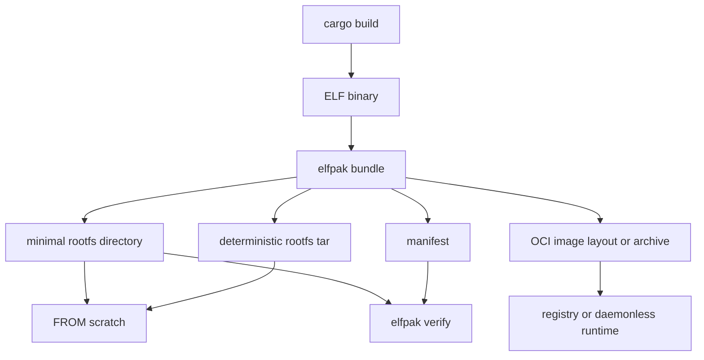

<p align="center">
  
</p>

<h1 align="center">elfpak</h1>

<p align="center"><b>Everything your app needs. Nothing else.</b></p>

-----

`elfpak` is an alternative to [`magicpak`](https://github.com/coord-e/magicpak). It turns a compiled binary and the filesystem it was built against into a deterministic, minimal **rootfs**. You can use this rootfs to build a small `FROM scratch` container or OCI image, with no unnecessary files. This gives you more secure container images, because only your application and its system dependencies remain exposed to possible security vulnerabilities.

### What you get in short

* very small artefacts
* only the files strictly needed to run your app
* much more secure container images



In detail: `elfpak` reads a Linux ELF executable. It resolves the runtime closure the same way the glibc loader does — through `PT_INTERP`, recursive `DT_NEEDED`, `DT_RPATH`/`DT_RUNPATH`, `$ORIGIN` expansion, `ld.so.cache`, and `ld.so.conf`. Then it copies exactly that closure into the bundle, with its original paths and symlinks. `elfpak` does not execute the binary, guess from filenames, or use tracing to find files.

`elfpak` supports `x86_64` and `aarch64`, including cross-architecture packaging from a foreign sysroot. It bundles statically linked and musl-linked binaries through generic ELF parsing. musl-specific loader behavior is out of scope.

> `cargo vendor`, but for an executable's Linux runtime.

## Quick start

```dockerfile
# syntax=docker/dockerfile:1

FROM ghcr.io/asaaki/elfpak:latest AS elfpak

FROM rust:1.98.0-slim-trixie AS build
WORKDIR /src
COPY --from=elfpak /elfpak /usr/local/bin/elfpak
COPY Cargo.toml Cargo.lock ./
COPY src ./src
RUN cargo build --release --locked && \
    cp target/release/my-server /my-server
RUN elfpak bundle /my-server \
    --output /rootfs \
    --install /app/server \
    --preset web \
    --user 65532:65532

FROM scratch
COPY --from=build /rootfs /
USER 65532:65532
WORKDIR /app
ENTRYPOINT ["/app/server"]
```

<small>Do not use <code>latest</code>. Pick a specific image tag instead (see the [registry](https://github.com/asaaki/elfpak/pkgs/container/elfpak)). You can also pin the image by its digest.</small>

The resulting image contains the application, its ELF closure, and the files the runtime policy asked for.

To use `elfpak` outside of a Docker build, install it with `cargo binstall`.

```sh
cargo binstall elfpak
```

## Cargo workflow

Install the Cargo adapter to package binaries from a Rust project.

```sh
cargo binstall cargo-elfpak

cargo elfpak bundle --release \
    --output rootfs \
    --install /app/server \
    --preset web
```

`cargo-elfpak` asks Cargo to build the selected binaries. Cargo reuses a binary when it is fresh. Cargo rebuilds a binary when a tracked input changed. `cargo-elfpak` passes the exact executable paths that Cargo reports to the normal `elfpak bundle` step.

Use `-p <package>` in an ambiguous workspace. Use `--bin <name>` when Cargo cannot infer a default binary for the package.

For a multi-binary project, you have three options: select a subset with `-p <package> --bins server,migrate`, select every binary in one package with `-p <package> --all-bins`, or select every binary in the workspace with `--all`. Use `--install-dir` to keep each binary's name under one directory.

```sh
cargo elfpak bundle --release \
  --all \
  --output rootfs \
  --install-dir /app \
  --preset web
```

## Commands

```text
elfpak inspect <binary>    analyze and print the runtime closure, copying nothing
elfpak bundle  <binary>... build a minimal rootfs plus a manifest
elfpak verify  <manifest>  check a materialized rootfs against its manifest
```

`bundle` writes any combination of these outputs from the same plan: a directory (`--output`), a deterministic rootfs tar (`--tar`, for `ADD rootfs.tar /`), an OCI image layout (`--oci-layout`), and an OCI layout archive (`--oci-archive`).

Use this to build a runnable image without Docker or a container daemon.

```sh
cargo elfpak bundle --release \
  --bin server \
  --oci-archive dist/server.oci.tar \
  --install /app/server \
  --image-tag ci \
  --entrypoint /app/server

skopeo copy \
    oci-archive:$PWD/dist/server.oci.tar:ci \
    docker://ghcr.io/example/server:latest
```

For the directory form, use `--oci-layout dist/server.oci` and `oci:$PWD/dist/server.oci:ci`. The archive is a tar of an OCI layout. Do not extract it at `/` like a rootfs tar. See [DOCUMENTATION.md](DOCUMENTATION.md#oci-image-output) for Skopeo, ORAS, Podman, nerdctl, Crane, and GHCR CI examples.

There are two presets. `minimal` is the ELF closure alone. `web` adds CA certificates, `/tmp`, `passwd`/`group`, and `nsswitch.conf`. You can also switch on each feature by itself. An optional `elfpak.toml` file can supply defaults.

A service packaged with `--preset web` can do DNS lookups and outbound HTTPS without CA-specific code in the application. The system trust store comes with the bundle.

## What makes it different

* **Loader semantics, not filename matching.** `elfpak` follows `PT_INTERP`, recursive `DT_NEEDED`, `DT_RPATH` inheritance versus `DT_RUNPATH`, `$ORIGIN`/`$LIB`/`$PLATFORM`, `ld.so.cache`, and `ld.so.conf`. It deliberately excludes unsafe CPU-specific glibc-hwcaps variants and validates the architecture of every candidate.
* **Original paths and symlinks stay intact.** `libfoo.so.1 -> libfoo.so.1.4.2` stays a symlink. `elfpak` does not relocate files into a private directory with a compensating `LD_LIBRARY_PATH`. When a library sits outside the directories the loader searches, the bundle gets a generated `/etc/ld.so.cache` instead. This cache is real and comes from the plan, because `elfpak` never runs `ldconfig`.
* **Every file has a recorded reason.** The manifest beside the rootfs names each included file, the reason for it, and the policy used to build it. `elfpak verify` checks the manifest again. `--strict` also rejects a file added afterward or a file with changed permissions.
* **An allow-list turns dependencies into a contract.** A new native dependency fails the build instead of growing the image without notice.
* **Cross-architecture.** `--root` abstracts the source filesystem. This lets an x86_64 `elfpak` package an aarch64 application from an aarch64 sysroot.

## Guarantees

`elfpak bundle` does not execute the target, call `ldd` or `ldconfig`, run shell commands, contact the network, or invoke Docker. OCI production is also daemonless. `elfpak` treats the source filesystem as read-only and writes only to the requested artifact destinations and their temporary siblings.

Tar output is deterministic for the same binaries, source root, configuration, and `elfpak` version. Set `SOURCE_DATE_EPOCH` to pin timestamps for planned files and directories. Tar is the portable, byte-reproducible output.

`elfpak` stages directory, tar, OCI, and manifest outputs beside their destinations and publishes them only when complete. As a result, a failed build leaves the previous artifact intact instead of exposing partial output. OCI layouts use one uncompressed, deterministic layer and content-addressed config and manifest blobs.

## Documentation

[DOCUMENTATION.md](DOCUMENTATION.md) covers the full CLI, runtime policy, configuration file, dependency policy, manifest format, resolver behavior, cross-architecture packaging, and the test suite.

## Development

```sh
just check              # fmt, clippy -D warnings, and the whole test suite
just test               # unit, integration and loader-oracle tests
just smoke              # Docker smoke tests (see DOCUMENTATION.md)
just smoke --fresh      # ... with nothing reused from a previous run
just oci-smoke          # Skopeo + Podman interoperability, no Docker

cargo run -p cargo-elfpak -- bundle --help

docker buildx build --platform linux/amd64,linux/arm64 -t elfpak:local --load .
```

The design takes ideas from [TigerStyle](https://tigerstyle.dev/): safety first, bounded work, explicit invariants, deterministic output, and performance that does not cost readable Rust. [STYLE.md](STYLE.md) records the project's adaptation. It does not impose mechanical line-count rules.

The distribution image is multi-platform and cross-compiled. Building every architecture never needs emulation.

## Status

`elfpak` implements rootfs, deterministic tar, and single-platform OCI image outputs for x86_64 and aarch64. It also has loader-oracle tests against real glibc and parser fuzzing. Future work includes runtime tracing (`elfpak trace`), multi-platform OCI index assembly, direct registry push, and SBOM generation.

## License

Licensed under either of

- Apache License, Version 2.0 ([LICENSE-APACHE](LICENSE-APACHE) or <http://www.apache.org/licenses/LICENSE-2.0>)
- MIT license ([LICENSE-MIT](LICENSE-MIT) or <http://opensource.org/licenses/MIT>)

at your option.

## Contribution

Unless you explicitly state otherwise, any contribution intentionally submitted for inclusion in the work by you, as defined in the Apache-2.0 license, shall be dual licensed as above, without any additional terms or conditions.
