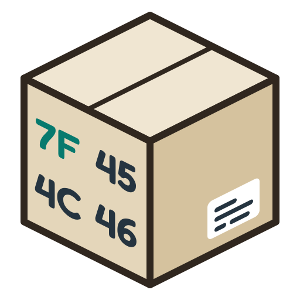
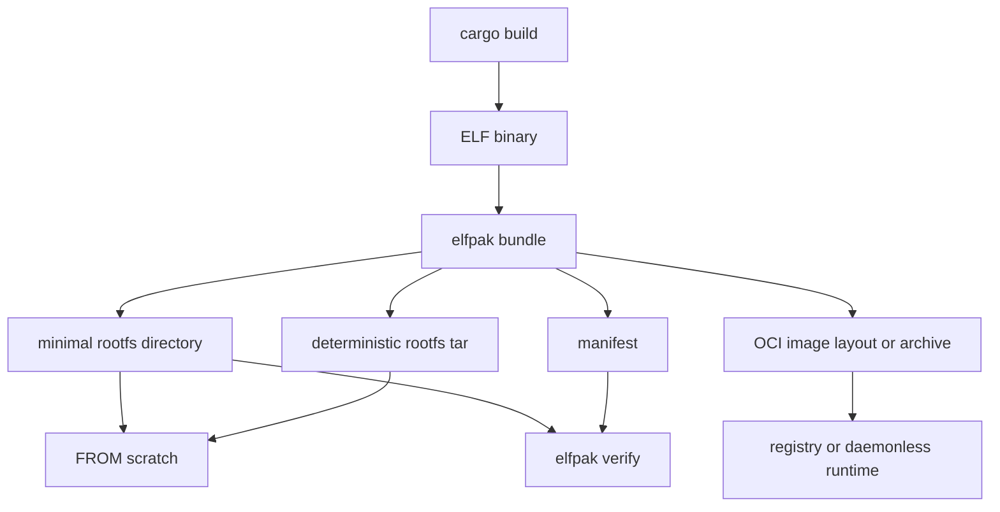

<p align="center">
  
</p>

<h1 align="center">elfpak</h1>

<p align="center"><b>Everything your app needs. Nothing else.</b></p>

-----

`elfpak` is an alternative for [`magicpak`](https://github.com/coord-e/magicpak), focused on turning a compiled binary plus the filesystem it was built against into a deterministic minimal **rootfs**. Which can then be used to produce a reasonably small `FROM scratch` container or OCI image, with no unnecessary cruft included. That leads to much more secure container images, leaving only your application and its system dependencies exposed to potential security vulnerabilities.

### What you get in short

* very small artefacts
* only the files strictly needed to run your app
* much more secure container images



Concretely: `elfpak` reads a Linux ELF executable, resolves its runtime closure the way the glibc loader would — `PT_INTERP`, recursive `DT_NEEDED`, `DT_RPATH`/`DT_RUNPATH`, `$ORIGIN` expansion, `ld.so.cache` and `ld.so.conf` — and copies exactly that closure, with its original paths and symlinks, into the bundle. Nothing is executed, guessed from filenames, or discovered by tracing. `x86_64` and `aarch64` are supported, including cross-architecture packaging from a foreign sysroot. Statically linked and musl-linked binaries are bundled through generic ELF parsing; musl-specific loader behaviour is a non-goal.

> `cargo vendor`, but for an executable's Linux runtime.

## Quick start

```dockerfile
# syntax=docker/dockerfile:1

FROM ghcr.io/asaaki/elfpak:latest AS elfpak

FROM rust:1.98.0-slim-trixie AS build
WORKDIR /src
COPY --from=elfpak /elfpak /usr/local/bin/elfpak
COPY Cargo.toml Cargo.lock ./
COPY src ./src
RUN cargo build --release --locked && \
    cp target/release/my-server /my-server
RUN elfpak bundle /my-server \
    --output /rootfs \
    --install /app/server \
    --preset web \
    --user 65532:65532

FROM scratch
COPY --from=build /rootfs /
USER 65532:65532
WORKDIR /app
ENTRYPOINT ["/app/server"]
```

<small>Instead of <code>latest</code>, pick an appropriate image tag (see [registry](https://github.com/asaaki/elfpak/pkgs/container/elfpak)); consider also to pin based on the image's digest.</small>

The resulting image contains the application, its ELF closure, and whatever the runtime policy asked for.

If you want to work with `elfpak` outside of a Docker build, install it with `cargo binstall`.

```sh
cargo binstall elfpak
```

## Cargo workflow

Install the Cargo adapter when packaging binaries from a Rust project:

```sh
cargo binstall cargo-elfpak

cargo elfpak bundle --release \
    --output rootfs \
    --install /app/server \
    --preset web
```

`cargo-elfpak` asks Cargo to build the selected binaries. Cargo reuses each one when it is fresh and rebuilds it when any tracked input changed; the exact executable paths Cargo reports are passed to the normal `elfpak bundle` implementation. Use `-p <package>` in an ambiguous workspace and `--bin <name>` when the package has no inferable default binary. Multi-binary projects can select a subset with `-p <package> --bins server,migrate`, every binary in one package with `-p <package> --all-bins`, or every binary in the workspace with `--all`; use `--install-dir` to preserve their names under one directory:

```sh
cargo elfpak bundle --release \
  --all \
  --output rootfs \
  --install-dir /app \
  --preset web
```

## Commands

```text
elfpak inspect <binary>    analyze and print the runtime closure, copying nothing
elfpak bundle  <binary>... build a minimal rootfs plus a manifest
elfpak verify  <manifest>  check a materialized rootfs against its manifest
```

`bundle` writes any combination of a directory (`--output`), deterministic rootfs tar (`--tar`, for `ADD rootfs.tar /`), OCI image layout (`--oci-layout`), and OCI layout archive (`--oci-archive`) from the same plan.

Build a runnable image without Docker or a container daemon:

```sh
cargo elfpak bundle --release \
  --bin server \
  --oci-archive dist/server.oci.tar \
  --install /app/server \
  --image-tag ci \
  --entrypoint /app/server

skopeo copy \
    oci-archive:$PWD/dist/server.oci.tar:ci \
    docker://ghcr.io/example/server:latest
```

Use `--oci-layout dist/server.oci` and `oci:$PWD/dist/server.oci:ci` for the directory form. The archive is a tar of an OCI layout, not a rootfs tar to extract at `/`. See [DOCUMENTATION.md](DOCUMENTATION.md#oci-image-output) for Skopeo, ORAS, Podman, nerdctl, Crane, and GHCR CI examples.

Two presets: `minimal` is the ELF closure alone, `web` adds CA certificates, `/tmp`, `passwd`/`group` and `nsswitch.conf`. Every feature is also switchable on its own, and an optional `elfpak.toml` can supply defaults.

A service packaged with `--preset web` does DNS and outbound HTTPS without any CA-specific code in the application; the system trust store comes along.

## What makes it different

* **Loader semantics, not filename matching.** `PT_INTERP`, recursive `DT_NEEDED`, `DT_RPATH` inheritance versus `DT_RUNPATH`, `$ORIGIN`/`$LIB`/`$PLATFORM`, `ld.so.cache`, `ld.so.conf`, deliberate exclusion of unsafe CPU-specific glibc-hwcaps variants, and architecture validation of every candidate.
* **Original paths and symlinks preserved.** `libfoo.so.1 -> libfoo.so.1.4.2` stays a symlink; nothing is relocated into a private directory with a compensating `LD_LIBRARY_PATH`. Where a library sits outside the directories the loader searches, the bundle gets a generated `/etc/ld.so.cache` instead — a real one, written from the plan, because `ldconfig` is never run.
* **Every file has a recorded reason.** The manifest beside the rootfs says what was included and why, along with the policy it was built with; `elfpak verify` re-checks it, and `--strict` also rejects anything that was added afterwards or whose permissions changed.
* **An allow-list turns dependencies into a contract.** A new native dependency fails the build instead of silently growing the image.
* **Cross-architecture.** `--root` abstracts the source filesystem, so an x86_64 `elfpak` can package an aarch64 application from an aarch64 sysroot.

## Guarantees

`elfpak bundle` does not execute the target, does not call `ldd` or `ldconfig`, does not run shell commands, does not contact the network, and does not invoke Docker. OCI production is likewise daemonless. It treats the source filesystem as read-only and writes only to requested artifact destinations and their temporary siblings.

Tar output is deterministic for the same binaries, source root, configuration and `elfpak` version. Set `SOURCE_DATE_EPOCH` to request pinned timestamps for planned files and directories; tar remains the portable byte-reproducible output.

Directory, tar, OCI, and manifest outputs are staged beside their destinations and published only when complete, so a failed build leaves the previous artifact intact instead of exposing partial output. OCI layouts use one uncompressed, deterministic layer and content-addressed config and manifest blobs.

## Documentation

[DOCUMENTATION.md](DOCUMENTATION.md) covers the full CLI, runtime policy, configuration file, dependency policy, manifest format, resolver behaviour, cross-architecture packaging and the test suite.

## Development

```sh
just check              # fmt, clippy -D warnings, and the whole test suite
just test               # unit, integration and loader-oracle tests
just smoke              # Docker smoke tests (see DOCUMENTATION.md)
just smoke --fresh      # ... with nothing reused from a previous run
just oci-smoke          # Skopeo + Podman interoperability, no Docker

cargo run -p cargo-elfpak -- bundle --help

docker buildx build --platform linux/amd64,linux/arm64 -t elfpak:local --load .
```

The design is inspired by [TigerStyle](https://tigerstyle.dev/): safety first, bounded work, explicit invariants, deterministic output, and performance that does not come at the cost of readable Rust. [STYLE.md](STYLE.md) records the project's adaptation without imposing mechanical line-count rules.

The distribution image is multi-platform and cross-compiled, so building every architecture never needs emulation.

## Status

Rootfs, deterministic tar, and single-platform OCI image outputs are implemented for x86_64 and aarch64, along with loader-oracle tests against real glibc and parser fuzzing. Runtime tracing (`elfpak trace`), multi-platform OCI index assembly, direct registry push, and SBOM generation remain future work.

## License

Licensed under either of

- Apache License, Version 2.0 ([LICENSE-APACHE](LICENSE-APACHE) or <http://www.apache.org/licenses/LICENSE-2.0>)
- MIT license ([LICENSE-MIT](LICENSE-MIT) or <http://opensource.org/licenses/MIT>)

at your option.

## Contribution

Unless you explicitly state otherwise, any contribution intentionally submitted for inclusion in the work by you, as defined in the Apache-2.0 license, shall be dual licensed as above, without any additional terms or conditions.
